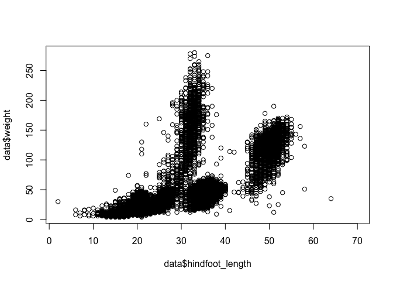
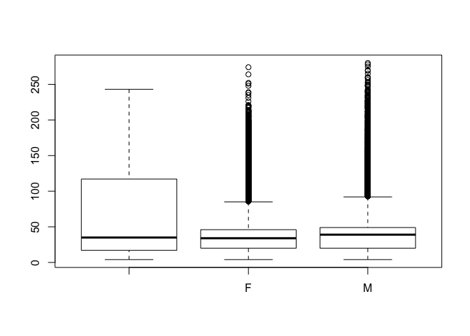
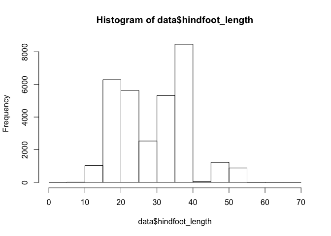
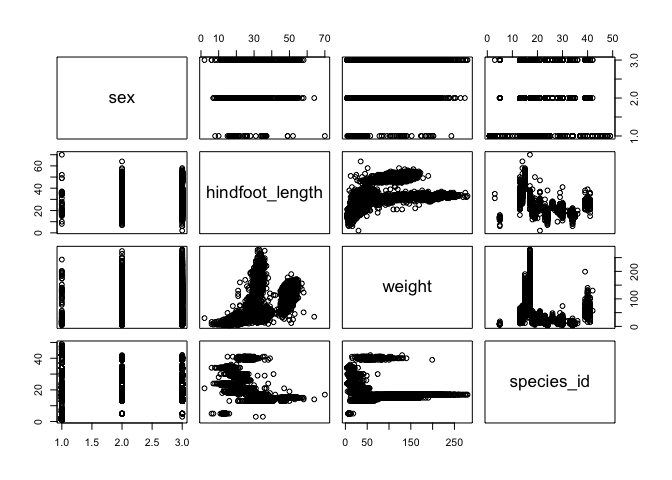
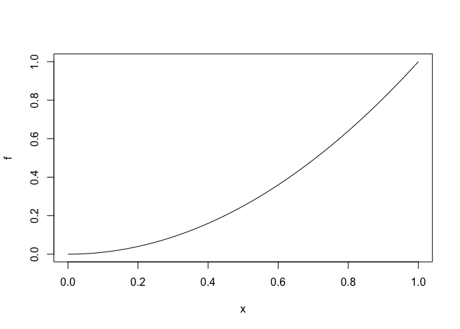
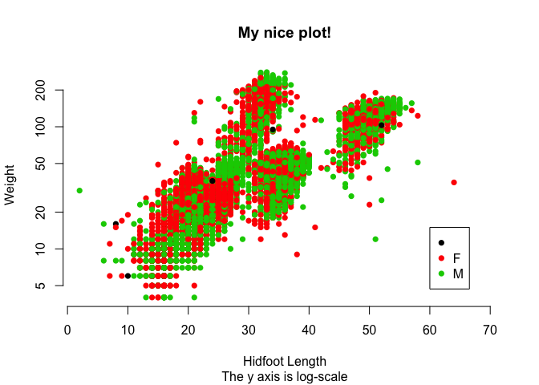
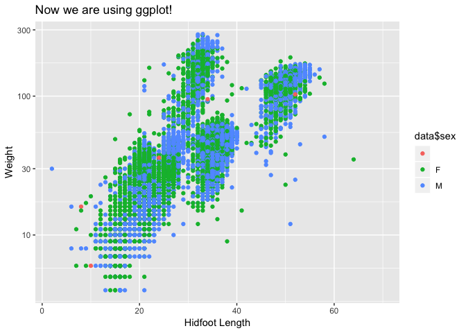
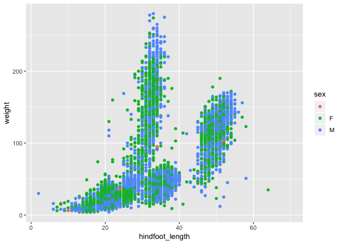
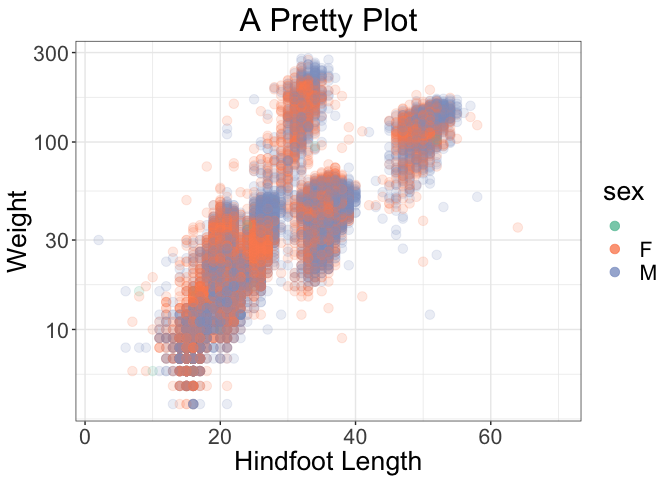

13-Plotting
================
David Mellert
2/8/2019

Plotting in R
-------------

One of the advantages of working with R is the ability to easily create amazing plots. Plots are usually created using base R or special graphics-related packages, with [ggplot2](https://ggplot2.tidyverse.org/index.html) being the most popular. For the sake of simplicity, this lesson will focus on base plotting, but we will also show you an example of ggplot2, because you will encounter it often.

The plot( ) function
--------------------

The generic function `plot()` seems to work like magic, but is fairly easy to understand if you are familiar with S3 objects. Lets go through some examples

``` r
data <- read.csv('../surveys.csv') #your path may differ here!
plot(data$hindfoot_length, data$weight)
```



``` r
plot(data$sex, data$weight)
```



``` r
hf_histogram <- hist(data$hindfoot_length, plot=FALSE)
plot(hf_histogram)
```



In each of the first two examples, we supplied vectors as arguments to `plot()`. The graphs look different, because the default `plot()` uses the data type of the vector to decide how to plot. Because `data$hindfoot_length` and `data$weight` are both of type `integer` (feel free to check yourself), `plot()` creates a scatterplot. When one of the the vectors is a `factor`, you get a boxplot.

Finally, in the last example, `plot()` took only a single argument, `hf_histogram`, which was the output of the `hist()` function. Recall from the previous lesson that `hist()` produces an S3 object:

``` r
typeof(hf_histogram)
```

    ## [1] "list"

``` r
class(hf_histogram)
```

    ## [1] "histogram"

``` r
methods(class='histogram')
```

    ## [1] lines plot 
    ## see '?methods' for accessing help and source code

Here we can see that objects of the class `histogram` will plot with their own special plotting method. This is the case for many objects in R -- most of the statistical functions will output an S3 object of a class specific to that function, and these classes will have their own method for plotting.

In fact, many functions will produce a plot immediately upon returning the object. For example:

``` r
hist(data$hindfoot_length) # note that we are not using the plot=FALSE parameter anymore
```


`data.frame` objects have a nice plotting method that allows you to explore the entire dataset at a glance:

``` r
df <- data[ ,c('sex', 'hindfoot_length', 'weight', 'species_id')] #take only a few columns to simplify
plot(df)
```



R can also plot functions:

``` r
f <- function(x){
  x^2
}
plot(f)
```



### Exercise 1

-   Create a plot comparing hindfoot\_length and weight, but only where species\_id == 'DM'

-   Use `?hist` to determine how to change the number of histogram 'bins', also referred to as 'cells'.

-   Create three histogram plots of `data$weight`-- one with the default number of bins, one with fewer bins, and one with more bins

Customizing plots
-----------------

`plot()` gives you a large number of options to customize the look of your plots. These can be quite complex to use, so here we will focus on a few simple parameters. You can explore these with `?plot` and `?plot.default` (or whichever method is being used to plot, e.g., `?plot.histogram`).

Let's try a few different options:

``` r
plot(data$hindfoot_length, data$weight,
     main = 'My nice plot!',
     sub = 'The y axis is log-scale',
     ylab = 'Weight',
     xlab = 'Hidfoot Length',
     col = data$sex, #colors points based on sex
     log = 'y', #sets y axis to log scale
     pch = 16, #changes shape of point; see ?points
     frame.plot = FALSE
     )
```


The `col` parameter in the above example chooses a color for each point based on an integer value. This makes sense because if you recall, factors in R take on integer values. You can check how factors are ordered (and thus their integer value) with `levels()`.

``` r
levels(data$sex)
```

    ## [1] ""  "F" "M"

To determine which color is used for each factor level, use `palette()`

``` r
palette()
```

    ## [1] "black"   "red"     "green3"  "blue"    "cyan"    "magenta" "yellow" 
    ## [8] "gray"

So in the plot above, when no sex is specified, the color is black. Female maps to red, and male maps to green.

Ideally, you would have all of the information you need to interpret colors right on the plot. You can add that with `legend()`.

``` r
#Start with the previous plot
plot(data$hindfoot_length, data$weight,
     main = 'My nice plot!',
     sub = 'The y axis is log-scale',
     ylab = 'Weight',
     xlab = 'Hidfoot Length',
     col = data$sex, 
     log = 'y', 
     pch = 16, 
     frame.plot = FALSE
     )

#Add legend
legend(x = 60, y = 15,
       legend=levels(data$sex),
       col = palette(),
       pch = 16)
```



### Exercise 2

-   Create another hindfoot\_length x weight scatterplot, but color the points by species and use a differently shaped point (see ?points to select values for the 'pch' paramter). Do you notice any interesting patterns?

ggplot2
-------

While base plotting is very powerful, many R users have adopted the ggplot2 package as their primary tool for creating beautiful figures. Aside from making plots that are (arguably) more aesthetically pleasing than base `plot()`, ggplot2 provides a natural-feeling syntax for plot creation. The ggplot2 system is incredibly deep, so we will not have the time to even scratch the surface here. However, the [documentation](https://ggplot2.tidyverse.org/reference/index.html) is excellent, and you are encouraged to explore it.

To use ggplot2, you will first need to install it by typing `install.packages('ggplot2')`.

To start, lets look at `qplot()`, which is meant to work similarly to base `plot()`:

``` r
library(ggplot2) #need to load ggplot2 first!

qplot(data$hindfoot_length, data$weight,
      main = 'Now we are using ggplot!',
      ylab = 'Weight',
      xlab = 'Hidfoot Length',
      log = 'y',
      color = data$sex #This colors the points and creates the legend automatically
      )
```



That plot was fairly easy to create, but it doesn't necessarily look as nice as the base plots without any additional tweaking. This is where `ggplot()` comes in. You first build a 'blank' plotting object:

``` r
p <- ggplot(data, #you start by choosing your data
            aes(x = hindfoot_length, #now add your 'aesthetic' options 
                y = weight,
                color = sex
                )
            )
class(p)
```

    ## [1] "gg"     "ggplot"

``` r
str(p)
```

    ## List of 9
    ##  $ data       :'data.frame': 35549 obs. of  9 variables:
    ##   ..$ record_id      : int [1:35549] 1 2 3 4 5 6 7 8 9 10 ...
    ##   ..$ month          : int [1:35549] 7 7 7 7 7 7 7 7 7 7 ...
    ##   ..$ day            : int [1:35549] 16 16 16 16 16 16 16 16 16 16 ...
    ##   ..$ year           : int [1:35549] 1977 1977 1977 1977 1977 1977 1977 1977 1977 1977 ...
    ##   ..$ plot_id        : int [1:35549] 2 3 2 7 3 1 2 1 1 6 ...
    ##   ..$ species_id     : Factor w/ 49 levels "","AB","AH","AS",..: 17 17 13 13 13 24 23 13 13 24 ...
    ##   ..$ sex            : Factor w/ 3 levels "","F","M": 3 3 2 3 3 3 2 3 2 2 ...
    ##   ..$ hindfoot_length: int [1:35549] 32 33 37 36 35 14 NA 37 34 20 ...
    ##   ..$ weight         : int [1:35549] NA NA NA NA NA NA NA NA NA NA ...
    ##  $ layers     : list()
    ##  $ scales     :Classes 'ScalesList', 'ggproto', 'gg' <ggproto object: Class ScalesList, gg>
    ##     add: function
    ##     clone: function
    ##     find: function
    ##     get_scales: function
    ##     has_scale: function
    ##     input: function
    ##     n: function
    ##     non_position_scales: function
    ##     scales: NULL
    ##     super:  <ggproto object: Class ScalesList, gg> 
    ##  $ mapping    :List of 3
    ##   ..$ x     : language ~hindfoot_length
    ##   .. ..- attr(*, ".Environment")=<environment: R_GlobalEnv> 
    ##   ..$ y     : language ~weight
    ##   .. ..- attr(*, ".Environment")=<environment: R_GlobalEnv> 
    ##   ..$ colour: language ~sex
    ##   .. ..- attr(*, ".Environment")=<environment: R_GlobalEnv> 
    ##   ..- attr(*, "class")= chr "uneval"
    ##  $ theme      : list()
    ##  $ coordinates:Classes 'CoordCartesian', 'Coord', 'ggproto', 'gg' <ggproto object: Class CoordCartesian, Coord, gg>
    ##     aspect: function
    ##     backtransform_range: function
    ##     clip: on
    ##     default: TRUE
    ##     distance: function
    ##     expand: TRUE
    ##     is_free: function
    ##     is_linear: function
    ##     labels: function
    ##     limits: list
    ##     modify_scales: function
    ##     range: function
    ##     render_axis_h: function
    ##     render_axis_v: function
    ##     render_bg: function
    ##     render_fg: function
    ##     setup_data: function
    ##     setup_layout: function
    ##     setup_panel_params: function
    ##     setup_params: function
    ##     transform: function
    ##     super:  <ggproto object: Class CoordCartesian, Coord, gg> 
    ##  $ facet      :Classes 'FacetNull', 'Facet', 'ggproto', 'gg' <ggproto object: Class FacetNull, Facet, gg>
    ##     compute_layout: function
    ##     draw_back: function
    ##     draw_front: function
    ##     draw_labels: function
    ##     draw_panels: function
    ##     finish_data: function
    ##     init_scales: function
    ##     map_data: function
    ##     params: list
    ##     setup_data: function
    ##     setup_params: function
    ##     shrink: TRUE
    ##     train_scales: function
    ##     vars: function
    ##     super:  <ggproto object: Class FacetNull, Facet, gg> 
    ##  $ plot_env   :<environment: R_GlobalEnv> 
    ##  $ labels     :List of 3
    ##   ..$ x     : chr "hindfoot_length"
    ##   ..$ y     : chr "weight"
    ##   ..$ colour: chr "sex"
    ##  - attr(*, "class")= chr [1:2] "gg" "ggplot"

Now you can add your points:

``` r
p + geom_point()
```



By adding various functions, you can build up a plotting 'recipe':

``` r
p + geom_point(alpha=1/6, size=3) + #make points slightly transparant and larger
  guides(colour = guide_legend(override.aes = list(alpha = .8))) + #override transparancy in legend
  scale_y_log10() + #make y axis log scale
  xlab('Hindfoot Length') +
  ylab('Weight') +
  ggtitle('A Pretty Plot') +
  theme_bw() + # change theme
  theme(text = element_text(size=20), #adjust text in theme
        plot.title = element_text(hjust = 0.5)) + #center plot title
  scale_color_brewer(palette='Set2') #change color palette
```


