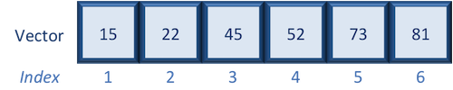

datastructures-vectors
================
Sandeep Namburi
February 04, 2019

------------------------------------------------------------------------

The materials used in this lesson are adapted from work from both members of the teaching team at the [Harvard Chan Bioinformatics Core (HBC)](http://bioinformatics.sph.harvard.edu/) and Data Carpentry (<http://datacarpentry.org/>).

-   HBC Intro to R Github: <https://github.com/hbctraining/Intro-to-R>
-   Data Carpentry Intro to R: <https://github.com/swcarpentry/r-novice-gapminder>

*This lesson has been developed by members of the teaching team at the [Harvard Chan Bioinformatics Core (HBC)](http://bioinformatics.sph.harvard.edu/). These are open access materials distributed under the terms of the [Creative Commons Attribution license](https://creativecommons.org/licenses/by/4.0/) (CC BY 4.0), which permits unrestricted use, distribution, and reproduction in any medium, provided the original author and source are credited.*

-   *The materials used in this lesson are adapted from work that is Copyright © Data Carpentry (<http://datacarpentry.org/>). All Data Carpentry instructional material is made available under the [Creative Commons Attribution license](https://creativecommons.org/licenses/by/4.0/) (CC BY 4.0).*

------------------------------------------------------------------------

### Vectors

Create a vector using the c() operator. Later, we will explore the vector() operator

``` r
x <- c(5.4, 6.2, 7.1, 4.8, 7.5)
names(x) <- c('a', 'b', 'c', 'd', 'e')
```

#### Selecting using indices

If we want to extract one or several values from a vector, we must provide one or several indices using square brackets `[ ]` syntax. The **index represents the element number within a vector** (or the compartment number, if you think of the bucket analogy). R indices start at 1. Programming languages like Fortran, MATLAB, and R start counting at 1, because that's what human beings typically do. Languages in the C family (including C++, Java, Perl, and Python) count from 0 because that's simpler for computers to do.

Let's start by creating a vector called age:

``` r
age <- c(15, 22, 45, 52, 73, 81)
```



Suppose we only wanted the fifth value of this vector, we would use the following syntax:

``` r
age[5]
```

    ## [1] 73

If we wanted all values except the fifth value of this vector, we would use the following:

``` r
age[-5]
```

    ## [1] 15 22 45 52 81

If we wanted to select more than one element we would still use the square bracket syntax, but rather than using a single value we would pass in a *vector of several index values*:

``` r
idx <- c(3,5,6) # create vector of the elements of interest
age[idx]
```

    ## [1] 45 73 81

To select a sequence of continuous values from a vector, we would use `:` which is a special function that creates numeric vectors of integer in increasing or decreasing order. Let's select the *first four values* from age:

`r   age[1:4]`

`## [1] 15 22 45 52`

Alternatively, if you wanted the reverse could try `4:1` for instance, and see what is returned.

------------------------------------------------------------------------

**Exercises**

1.  Create a vector called alphabets with the following letters, C, D, X, L, F.
2.  Use the associated indices along with `[ ]` to do the following:

-   only display C, D and F
-   display all except X
-   display the letters in the opposite order (F, L, X, D, C)

------------------------------------------------------------------------

\#\#\#\# Selecting using indices with logical operators

We can also use indices with logical operators. Logical operators include greater than (&gt;), less than (&lt;), and equal to (==). A full list of logical operators in R is displayed below:

| Operator | Description              |
|:--------:|:-------------------------|
|   &gt;   | greater than             |
|   &gt;=  | greater than or equal to |
|   &lt;   | less than                |
|   &lt;=  | less than or equal to    |
|    ==    | equal to                 |
|    !=    | not equal to             |
|     &    | and                      |
|     |    | or                       |

We can use logical expressions to determine whether a particular condition is true or false. For example, let's use our age vector:

``` r
age
```

    ## [1] 15 22 45 52 73 81

If we wanted to know if each element in our age vector is greater than 50, we could write the following expression:

``` r
age > 50
```

    ## [1] FALSE FALSE FALSE  TRUE  TRUE  TRUE

Returned is a vector of logical values the same length as age with TRUE and FALSE values indicating whether each element in the vector is greater than 50.

``` r
# [1] FALSE FALSE FALSE  TRUE  TRUE  TRUE
```

We can use these logical vectors to select only the elements in a vector with TRUE values at the same position or index as in the logical vector.

Create an index with logical operators to select all values in the `age` vector over 50 **or** `age` less than 18:

``` r
idx <- age > 50 | age < 18

idx
```

    ## [1]  TRUE FALSE FALSE  TRUE  TRUE  TRUE

``` r
age
```

    ## [1] 15 22 45 52 73 81

``` r
age[idx]
```

    ## [1] 15 52 73 81

##### Indexing with logical operators using the `which()` function

While logical expressions will return a vector of TRUE and FALSE values of the same length, we could use the `which()` function to output the indices where the values are TRUE. Indexing with either method generates the same results, and personal preference determines which method you choose to use. For example:

``` r
idx <- which(age > 50 | age < 18)

idx
```

    ## [1] 1 4 5 6

``` r
age[idx]
```

    ## [1] 15 52 73 81

Notice that we get the same results regardless of whether or not we use the `which()`. Also note that while `which()` works the same as the logical expressions for indexing, it can be used for multiple other operations, where it is not interchangeable with logical expressions.

> **Note about *Nesting* functions**:
>
> Instead of creating the `idx` object in the above sections, we could have just place the logical operations and/or functions within the brackets.
>
> `age[which(age > 50 | age < 18)]` **is identical to** `age[idx]` above.

------------------------------------------------------------------------

------------------------------------------------------------------------

Vectors and Type Coercion
-------------------------

To better understand this behavior, let's create another vector, using `vector` function: the *vector*.

``` r
my_vector <- vector(length = 3)
my_vector
```

    ## [1] FALSE FALSE FALSE

A vector in R is essentially an ordered list of things, with the special condition that *everything in the vector must be the same basic data type*. If you don't choose the datatype, it'll default to `logical`; or, you can declare an empty vector of whatever type you like.

``` r
another_vector <- vector(mode='character', length=3)
another_vector
```

    ## [1] "" "" ""

You can check if something is a vector:

``` r
str(another_vector)
```

    ##  chr [1:3] "" "" ""

The somewhat cryptic output from this command indicates the basic data type found in this vector - in this case `chr`, character; an indication of the number of things in the vector - actually, the indexes of the vector, in this case `[1:3]`; and a few examples of what's actually in the vector - in this case empty character strings. If we similarly do

``` r
data <- read.csv(file="surveys.csv")
str(data$weight)
```

    ##  int [1:35549] NA NA NA NA NA NA NA NA NA NA ...

we see that `cats$weight` is a vector, too - *the columns of data we load into R data.frames are all vectors*, and that's the root of why R forces everything in a column to be the same basic data type.

> Discussion 1
> ------------
>
> Why is R so opinionated about what we put in our columns of data? How does this help us?
>
> > Discussion 1
> > ------------
> >
> > By keeping everything in a column the same, we allow ourselves to make simple assumptions about our data; if you can interpret one entry in the column as a number, then you can interpret *all* of them as numbers, so we don't have to check every time. This consistency is what people mean when they talk about *clean data*; in the long run, strict consistency goes a long way to making our lives easier in R. {: .solution} {: .discussion}

You can also make vectors with explicit contents with the combine function:

``` r
combine_vector <- c(2,6,3)
combine_vector
```

    ## [1] 2 6 3

Given what we've learned so far, what do you think the following will produce?

``` r
quiz_vector <- c(2,6,'3')
```

This is something called *type coercion*, and it is the source of many surprises and the reason why we need to be aware of the basic data types and how R will interpret them. When R encounters a mix of types (here numeric and character) to be combined into a single vector, it will force them all to be the same type. Consider:

``` r
coercion_vector <- c('a', TRUE)
coercion_vector
```

    ## [1] "a"    "TRUE"

``` r
another_coercion_vector <- c(0, TRUE)
another_coercion_vector
```

    ## [1] 0 1

The coercion rules go: `logical` -&gt; `integer` -&gt; `numeric` -&gt; `complex` -&gt; `character`, where -&gt; can be read as *are transformed into*. You can try to force coercion against this flow using the `as.` functions:

``` r
character_vector_example <- c('0','2','4')
character_vector_example
```

    ## [1] "0" "2" "4"

``` r
character_coerced_to_numeric <- as.numeric(character_vector_example)
character_coerced_to_numeric
```

    ## [1] 0 2 4

``` r
numeric_coerced_to_logical <- as.logical(character_coerced_to_numeric)
numeric_coerced_to_logical
```

    ## [1] FALSE  TRUE  TRUE

As you can see, some surprising things can happen when R forces one basic data type into another! Nitty-gritty of type coercion aside, the point is: if your data doesn't look like what you thought it was going to look like, type coercion may well be to blame; make sure everything is the same type in your vectors and your columns of data.frames, or you will get nasty surprises!

The combine function, `c()`, will also append things to an existing vector:

``` r
ab_vector <- c('a', 'b')
ab_vector
```

    ## [1] "a" "b"

``` r
combine_example <- c(ab_vector, 'SWC')
combine_example
```

    ## [1] "a"   "b"   "SWC"

You can also make series of numbers:

``` r
mySeries <- 1:10
mySeries
```

    ##  [1]  1  2  3  4  5  6  7  8  9 10

``` r
seq(10)
```

    ##  [1]  1  2  3  4  5  6  7  8  9 10

``` r
seq(1,10, by=0.1)
```

    ##  [1]  1.0  1.1  1.2  1.3  1.4  1.5  1.6  1.7  1.8  1.9  2.0  2.1  2.2  2.3
    ## [15]  2.4  2.5  2.6  2.7  2.8  2.9  3.0  3.1  3.2  3.3  3.4  3.5  3.6  3.7
    ## [29]  3.8  3.9  4.0  4.1  4.2  4.3  4.4  4.5  4.6  4.7  4.8  4.9  5.0  5.1
    ## [43]  5.2  5.3  5.4  5.5  5.6  5.7  5.8  5.9  6.0  6.1  6.2  6.3  6.4  6.5
    ## [57]  6.6  6.7  6.8  6.9  7.0  7.1  7.2  7.3  7.4  7.5  7.6  7.7  7.8  7.9
    ## [71]  8.0  8.1  8.2  8.3  8.4  8.5  8.6  8.7  8.8  8.9  9.0  9.1  9.2  9.3
    ## [85]  9.4  9.5  9.6  9.7  9.8  9.9 10.0

We can ask a few questions about vectors:

``` r
sequence_example <- seq(10)
head(sequence_example, n=2)
```

    ## [1] 1 2

``` r
tail(sequence_example, n=4)
```

    ## [1]  7  8  9 10

``` r
length(sequence_example)
```

    ## [1] 10

``` r
class(sequence_example)
```

    ## [1] "integer"

``` r
typeof(sequence_example)
```

    ## [1] "integer"

``` r
summary(sequence_example)
```

    ##    Min. 1st Qu.  Median    Mean 3rd Qu.    Max. 
    ##    1.00    3.25    5.50    5.50    7.75   10.00

``` r
mean(sequence_example)
```

    ## [1] 5.5

``` r
median(sequence_example)
```

    ## [1] 5.5

Finally, you can give names to elements in your vector:

``` r
my_example <- 5:8
names(my_example) <- c("a", "b", "c", "d")
my_example
```

    ## a b c d 
    ## 5 6 7 8

``` r
names(my_example)
```

    ## [1] "a" "b" "c" "d"

> Challenge 1
> -----------
>
> Start by making a vector with the numbers 1 through 26. Multiply the vector by 2, and give the resulting vector names A through Z (hint: there is a built in vector called `LETTERS`)
>
> > Solution to Challenge 1
> > -----------------------
> >
> > ``` r
> > x <- 1:26
> > x <- x * 2
> > names(x) <- LETTERS
> > ```
> >
> > {: .solution} {: .challenge}
